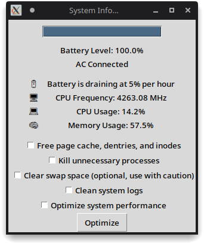
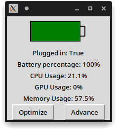
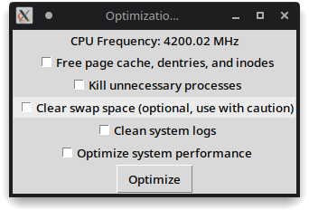
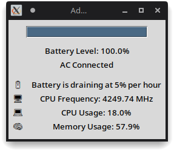

# PythonPower Profile
This Project is making of power Profile for linux system. It is a simple python script that will generate a power profile for your linux system. It will show you the power consumption of your system in real time

It also shows memory usage, CPU usage, and temperature of your system.

## Screenshots
Here are some screenshots of the script:



Screenshots of the script in src folder:
<div>
    
    
    
</div>

## Installation
To install this script, you need to have python3 installed on your system. You can install it by running the following command:
```bash
sudo apt install python3
```

We also need to install the psutil and tkinter library. You can install it by running the following command:
```bash
pip install psutil
pip install tkinter
```

After installing python3, you can download the script by running the following command:
```bash
git clone
```

## Usage
To use this script, you need to run the following command:
```bash
python3 power_profile.py
```

## Contributing
Pull requests are welcome. For major changes, please open an issue first to discuss what you would like to change.

Please make sure to update tests as appropriate.